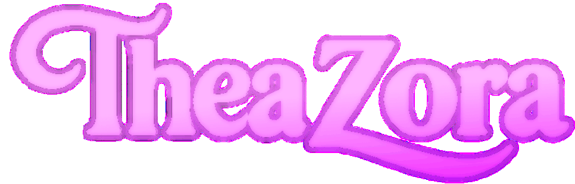

<!-- Note: GitHub doesn't support CSS transitions or :hover pseudo-classes -->
<!-- Using inline event handlers where needed for interactive effects -->

<!-- Terminal-style header with ASCII art -->

#  Hey, I'm  👋🏽

**Creative Technologist | Full-Stack Engineer | Change Management & UX Architect**

---

## 📊 **GitHub Activity**

<!-- Activity Graph -->

<!-- Top Languages -->

---

## 🌐 About Me

I'm **Thea Zora**, a multidisciplinary designer and engineer blending **technology, art, and systems thinking**.  
With over a decade of experience in **Change & Configuration Management**, **Full-Stack Development**, and **Creative Technology**, I build immersive, accessible, and emotionally resonant digital systems, from enterprise IT portals to interactive and immersive online experiences.

🕸️ Explore my portfolio: **[theazora.dev](https://theazora.dev)**

---

## 🚀 Featured Projects

### 🎵 **Jamrize.com**

**Create. Connect. Collaborate.**

A central hub for music collaboration across platforms uniting artists, producers, and developers under one roof. Jamrize powers cross-app connections like PianoNet and OpalVox, serving as the creative nucleus for real-time music creation.

**Tech Stack:**  
&nbsp;
&nbsp;
&nbsp;
&nbsp;

**Key Features:**
- › Unified artist profiles
- › Real-time audio sessions
- › Cloud-based project syncing

---

### 🎹 **PianoNet.io**

**Play Together in Real Time**

A real-time collaborative piano web app that lets multiple users play, record, and visualize music simultaneously, no installation required. PianoNet.io connects musicians around the world through low-latency WebRTC and expressive synesthetic visuals.

**Tech Stack:**  
&nbsp;
&nbsp;
&nbsp;
&nbsp;
&nbsp;

**Key Features:**
- › Multi-user live piano sessions
- › Synesthesia-style visual effects
- › Private and public room codes

---

### 🎤 **OpalVox.space**

**Shape the Voice of Tomorrow**

A real-time vocal modulation and synthesis environment built for expressive performance and dynamic vocalization. OpalVox integrates advanced DSP, formant shaping, and spectral processing to help users explore and refine their vocal range and frequencies. Designed for speakers and musicians seeking precise, intuitive tools for voice transformation and timbral design.

**Tech Stack:**  
&nbsp;
&nbsp;
&nbsp;
&nbsp;

**Key Features:**
- › ML-driven vocal filters
- › Real-time modulation
- › Layered harmonizer engine

---

### 🌐 **Vntro.net**

**Global Venture Network**

A futuristic digital ecosystem for creative and technical ventures, blending brand identity, AR/VR immersion, and connected enterprise infrastructure. Vntro.net is the foundation of TheaZora's global venture framework-bridging technology, art, and business innovation.

**Tech Stack:**  
&nbsp;
&nbsp;
&nbsp;
&nbsp;

**Key Features:**
- › Immersive 3D brand navigation
- › Modular venture portals
- › Real-time global network sync

---

### 🔮 **wulfie.dev**

**The Cryptic Integration Circuit**

A minimalist experimental sandbox that bridges creative coding, cyber aesthetics, and decentralized integration. Wulfie is both a manifesto and a circuit-connecting prototypes, ideas, and alternate digital realities under one symbolic framework.

**Tech Stack:**  
&nbsp;
&nbsp;
&nbsp;
&nbsp;

**Key Features:**
- › Interactive coded lore
- › Terminal-style interface
- › Experimental data nodes

---

### 🎴 **SCards**

**Card Game Platform**

A card game place holder for the 6th project. Coming soon with innovative gameplay and interactive features.

**Tech Stack:**  
*To be announced*

**Key Features:**
- › Coming soon
- › Interactive gameplay
- › Real-time multiplayer

---

## 🧠 Professional Focus

- **ITSM & Change Management:** Governance design, CAB leadership, process automation, and CMDB integrity.  
- **Creative Engineering:** WebRTC, AR/VR integration, and real-time systems for music & collaboration.  
- **UX & Brand Systems:** Accessibility-driven design, identity architecture, and humanized interfaces.  
- **Enterprise Platform Development:** ServiceNow, Node.js microservices, and cloud automation.

---

## ⚙️ My Tech Stacks

### 💻 Frontend  
&nbsp;
&nbsp;
&nbsp;
&nbsp;
&nbsp;
&nbsp;

---

### ⚙️ Backend  
&nbsp;
&nbsp;
&nbsp;
&nbsp;
&nbsp;
&nbsp;

---

### ☁️ Cloud / DevOps  
&nbsp;
&nbsp;
&nbsp;
&nbsp;
&nbsp;

---

### 🧩 Languages  
&nbsp;
&nbsp;
&nbsp;

---

### 🎨 Creative / Media  
&nbsp;
&nbsp;
&nbsp;
&nbsp;
&nbsp;

---

## 💬 Let's Connect

---

